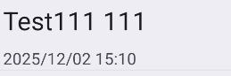
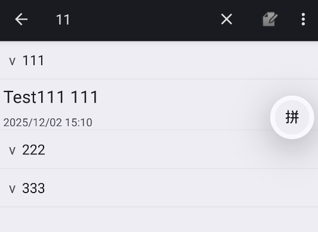
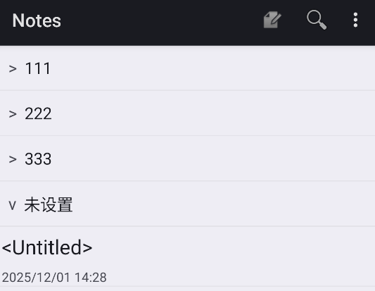
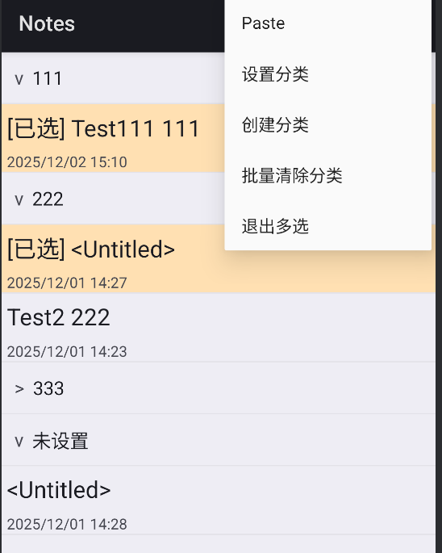
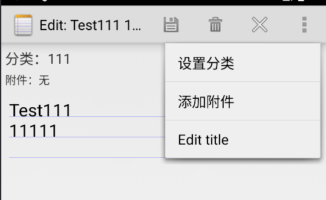

# NotePad 功能拓展
## 功能说明和预览
### 时间戳
在笔记列表中每个笔记标题下方会显示笔记最后被修改的时间，若笔记未保存仅退出则不修改时间。


### 搜索
在笔记列表界面的功能栏有**搜索栏**，可以输入关键词搜索笔记的标题与内容。


### 分类
在笔记列表界面可以对笔记进行分类，分类可以展开或收起，在打开笔记软件时，默认打开所有的笔记分类。长按笔记条目可以进行多选，或右上角拓展菜单栏里有进入**多选**的按钮，可以批量将笔记加入某个分类，该分类名若不存在则会创建分类，亦可以直接在拓展菜单栏里直接创建一个空分类。在笔记编辑界面也可以对笔记所属分类进行设置，若不设置分类，则会加入默认分类中。




### 附件
在编辑笔记时，可以通过添加附件按钮，选择图片或视频添加到笔记中。


## 数据结构
新增分类表 `categories`：`_ID`, `name`，见 `app/src/main/java/com/example/android/notepad/NotePadProvider.java`。

## 功能实现
### 1) 时间戳展示与搜索
- 列表布局 `app/src/main/res/layout/noteslist_item.xml` 在第二行展示修改时间，`NotesList.java` 用 `yyyy/MM/dd HH:mm` 格式化后填充。
- 顶部菜单的 `SearchView` 监听输入，实时调用 `loadNotes(keyword)` 对标题与正文执行 `LIKE` 过滤。
```java
// NotesList.java
private void loadNotes(String keyword) {
    String selection = null;
    String[] args = null;
    if (!TextUtils.isEmpty(keyword)) {
        selection = NotePad.Notes.COLUMN_NAME_TITLE + " LIKE ? OR " +
                NotePad.Notes.COLUMN_NAME_NOTE + " LIKE ?";
        String like = "%" + keyword + "%";
        args = new String[]{ like, like };
    }
    Cursor cursor = managedQuery(getIntent().getData(), PROJECTION, selection, args,
            NotePad.Notes.DEFAULT_SORT_ORDER);
    ...
}
// 适配器绑定修改时间
holder.timestamp.setText(mDateFormat.format(new Date(item.modified)));
```

### 2) 保存/退出与时间戳
- 只有点击“保存”才调用 `updateNote` 更新内容与修改时间，点击“退出”不会刷新时间戳。
- 新建空笔记在退出 Activity 时会被删除，避免空记录留存。
```java
// NoteEditor.java
if (id == R.id.menu_save) {
    updateNote(mText.getText().toString(), null);
    finish();
} else if (id == R.id.menu_exit) {
    cancelNote();
    return true;
}
protected void onPause() {
    if (isFinishing() && mState == STATE_INSERT && mText.length() == 0) {
        deleteNote(); // 退出时清理空笔记
    }
    super.onPause();
}
```

### 3) 分类：折叠视图、批量设置/清除、空/默认分类
- `NoteMetadataStore` 维护 `categories` 表，兼容旧 SharedPreferences；新建笔记默认写入 `category_default`。
- 列表按分类折叠/展开，空分类显示“未设置”；即使分类下暂时没有笔记也会生成折叠头方便创建。
- 多选模式可批量设置或清除分类，操作后刷新列表。
```java
// NotesList.java —— 按分类分组并生成可折叠的表头
Map<String, List<RowItem>> grouped = new HashMap<>();
for (RowItem n : notes) {
    String cat = TextUtils.isEmpty(n.category) ? getString(R.string.category_none) : n.category;
    if (!grouped.containsKey(cat)) grouped.put(cat, new ArrayList<RowItem>());
    grouped.get(cat).add(n);
}
for (String cat : mMetadataStore.getAllCategories()) {
    RowItem header = new RowItem();
    header.type = RowItem.TYPE_CATEGORY;
    header.category = cat;
    header.expanded = mCategoryExpanded.containsKey(cat) ? mCategoryExpanded.get(cat) : true;
    display.add(header);
    if (header.expanded) display.addAll(grouped.get(cat));
}
// 多选批量设置/清除分类
showCategoryDialogForSelection() {
    for (Long id : mSelectedIds) mMetadataStore.setCategory(id, finalValue);
    exitMultiSelect();
    loadNotes(mCurrentKeyword);
}
clearCategoryForSelection() {
    for (Long id : mSelectedIds) mMetadataStore.setCategory(id, null);
    exitMultiSelect();
    loadNotes(mCurrentKeyword);
}
// NoteEditor.java —— 新建时写入默认分类
String def = getString(R.string.category_default);
mMetadataStore.setCategory(mNoteId, def);
```

### 4) 附件：直接从相册/媒体选择图片或视频
- 编辑器菜单提供“添加附件”，通过 `ACTION_OPEN_DOCUMENT` 选择 `image/*` 或 `video/*`，持久化读权限后将 Uri 写入元数据表。
```java
private void launchAttachmentPicker(String typeKey) {
    Intent intent = new Intent(Intent.ACTION_OPEN_DOCUMENT);
    intent.addCategory(Intent.CATEGORY_OPENABLE);
    intent.setType("image".equals(typeKey) ? "image/*" : "video/*");
    startActivityForResult(intent, "image".equals(typeKey) ? REQ_PICK_IMAGE : REQ_PICK_VIDEO);
}
protected void onActivityResult(int requestCode, int resultCode, Intent data) {
    if (resultCode != RESULT_OK || data == null || data.getData() == null) return;
    Uri uri = data.getData();
    getContentResolver().takePersistableUriPermission(uri,
            data.getFlags() & Intent.FLAG_GRANT_READ_URI_PERMISSION);
    if (requestCode == REQ_PICK_IMAGE) mMetadataStore.addAttachment(mNoteId, "image", uri.toString());
    else if (requestCode == REQ_PICK_VIDEO) mMetadataStore.addAttachment(mNoteId, "video", uri.toString());
    refreshMetadataViews();
}
```
